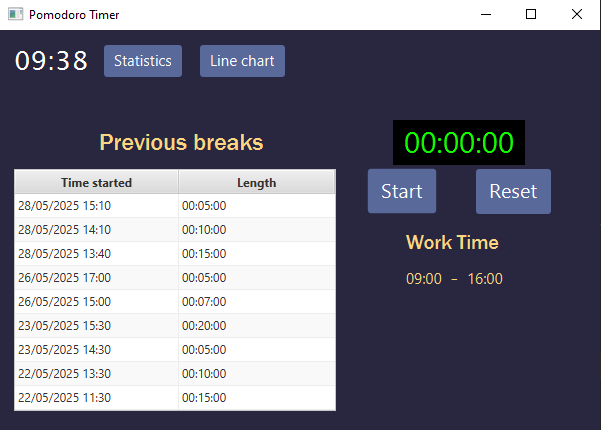



# Pomodoro timer ⏱️

This is a simple pomodoro timer meant for timing breaks during a workday, as well as keeping track of your break flow over time. You can start and pause a break, then reset the timer to save the break time locally. The program puts all your data in a statistics page and you can view your habits over time in a line chart.

## Features 🚀

* 🕒 Real-time Pomodoro timer with pause/reset functionality

* 📊 Break tracking and stats table (persisted to breaks.json)

* 📁 Settings saved to settings.json

* 🖱️ Interactive spinners for work time customization

* 📈 Switchable scenes for statistics and line chart view


## Installation 🛠️

### Clone the repository

```bash
  git clone https://github.com/marcushoja0108/PomodoroApp
  cd PomodoroApp
```
### Open in IntelliJ
* Select File -> Open... and choose the project directory.
* Make sure JavaFX is configured:
    * Project **Structure -> Libraries**
    * Add the **JavaFX SDK** if not already configured

### Run the app
* Locate Main.java inside com.pomodoroapp.pomodoroapp
* Right-click -> Run Main.main()
## 📁 Project Structure
```
PomodoroApp/
├── src/
│   └── main/
│       ├── java/
│       │   └── com/pomodoroapp/pomodoroapp/    <-- Main, Controllers and classes
│       │       ├── Main.java
│       │       ├── MainController.java
│       │       ├── StatisticsController.java
│       │       ├── LineChartController.java
│       │       ├── BreakTime.java
│       │       ├── Settings.java
│       └── resources/
│           └── pomodoroapp/                    <-- FXML views and css files
│               ├── main-view.fxml
│               ├── Main.css
│               ├── statistics-view.fxml
│               └── lineChart-view.fxml
├── breaks.json         <-- Auto-generated break session data
├── settings.json       <-- Stores custom work time settings
└── README.md
```

## Dependencies 📦
* **JavaFX**(UI framework)
* **GSON**(for JSON persistence)